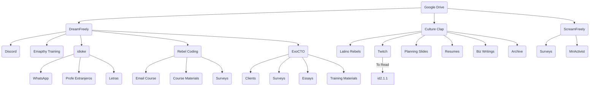

## Assignment Book

[[Monthly Budget]]

[[Fundraising]]

[[Weekly]]

[[Monthly]]

[[Yearly]]

```mermaid
graph TD

%% Top Node
id0(Google Drive)

%% Media Sources
id1(DreamFreely)
id2(Culture Clap)
id3(ScreamFreely)

%% Types Of Media
id1.1(Latino Rebels)
id1.2(Discord)
id1.3(Emapthy Training)
id1.4(idioke)
id1.4.1(WhatsApp)
id1.4.2(Profe Extranjeros)
id1.4.3(Letras)
id1.5(Rebel Coding)
id1.5.1(Email Course)
id1.5.2(Course Materials)
id1.5.3(Surveys)
id1.6(ExoCTO)
id1.6.1(Clients)
id1.6.2(Surveys)
id1.6.3(Essays)
id1.6.4(Training Materials)

%% Types Of Media
id2.1(Twitch)
id2.2(Planning Slides)
id2.3(Resumes)
id2.4(Biz Writings)
id2.5(Photos)
id2.5(Music)
id2.5(Archive)

%% Types Of Media
id3.1(Surveys)
id3.2(MnActivist)


id0 --> id1
id0 --> id2
id0 --> id3

id2  --> id1.1
id1  --> id1.2
id1  --> id1.3
id1  --> id1.4
id1.4  --> id1.4.1
id1.4  --> id1.4.2
id1.4  --> id1.4.3
id1  --> id1.5
id1.5  --> id1.5.1
id1.5  --> id1.5.2
id1.5  --> id1.5.3
id1  --> id1.6
id1.6  --> id1.6.1
id1.6  --> id1.6.2
id1.6  --> id1.6.3
id1.6  --> id1.6.4

id2  --> id2.1
id2  --> id2.2
id2  --> id2.3
id2  --> id2.4
id2 --> id2.5

id3  --> id3.1
id3  --> id3.2

id2.1 -- To Read --> id2.1.1

```
